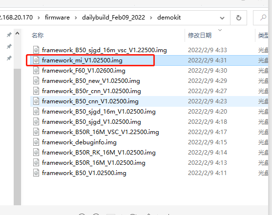

Wednesday ,Februnary 10 ,2022 driver for time vsync.

# List:
1. MIC模拟录音时，抓一个DUMP寄存器。交给徐雄风
2. 三星手机apk验证。晚上拿设备验证。
3. 时间同步驱动，源码流程梳理清楚。同时可以开发一个动态驱动到835盒子中，验证。当前是junkeV2的模块。

# DONE:
1. VSCDMEO执行程序运行。
- 首先Ubuntu需要设置环境
```
opencv3.2: sudo apt-get install libopencv-dev
 ffmpeg3.4.8: sudo apt-get install ffmpeg
 libusb:  sudo apt-get install libusb-1.0-0-dev
 libudev: sudo apt-get install libudev-dev
```
获取所有寄存器内容。
2 0xfe 0x32 0x27 0x00 0x00 2
Command response:
0x01 0xFE 0x20 0x04 0x55 0x73 0x62 0x50 0x75 0x6D 
0x70 0x56 0x73 0x63 0x41 0x70 0x70 0x49 0x5F 0x45 
0x76 0x65 0x6E 0x74 0x3A 0x5B 0x55 0x73 0x62 0x50 
0x75 0x6D 0x70 0x56 0x73 0x63 0x41 0x70 0x70 0x49 
0x5F 0x45 0x76 0x65 0x6E 0x74 0x5D 0x20 0x45 0x76 
0x65 0x6E 0x74 0x3A 0x20 0x32 0x0D 0x0A 0x55 0x73 
0x62 0x50 0x75 Command executed! 
--交给徐雄风
2. 三星手机连接眼镜问题 
- adb -s 192.168.22.128:5555 logcat | tee $(date "+%Y%m%d%H%M%S")samsungandroid.txt
- 如果打开unitySDK，B50眼镜连接，可以正常。但是过了一会就会出现
```
第一次：
02-10 11:10:55.242  8168  8607 E std     : Read HID failed: 
02-10 11:10:55.242  8168  8607 E std     : -1
02-10 11:10:55.242  8168  8607 E std     : 
02-10 11:10:55.244  8168  8607 E std     : Read HID failed: 
02-10 11:10:55.244  8168  8607 E std     : -1
02-10 11:10:55.244  8168  8607 E std     : 

第二次：
02-10 11:18:18.684  8561 10036 I XVisio  : No pose for type 1
02-10 11:18:18.701  8561 10036 I XVisio  : No pose for type 1
02-10 11:18:18.718  8561 10036 I XVisio  : No pose for type 1


```

- 如果打开xslam，B50眼镜连接，可以正常。但是过了一会就会出现
```
02-10 11:13:43.680  6484  9223 W xvsdk   : 5771.01167 [warn][9223    ] Read HID failed: -1
02-10 11:13:43.710  6484  9235 W XVisio  : [5771.0418] WARNING:  *** SlamLoader: No IMU received since : 2.58642 sec
02-10 11:13:43.710  6484  9235 W XVisio  : [5771.0419] WARNING:  *** SlamLoader: No fisheye image received since : 2.58947 sec
02-10 11:13:43.725  6484  9211 D xslam wrapper: eddy nAddUsbDevice 0
02-10 11:13:43.725  6484  9211 V xvsdk   : 5771.05661 [trac][9211    ] HID write: 0x02fd660210000000000000000000000000000000000000000000000000000000...
02-10 11:13:43.725  6484  9211 E xvsdk   : 5771.05674 [erro][9211    ] Failed to write HID


第二次：

02-10 11:28:19.315  1148  1148 E Native_CFMS: nativePerfMgrRemoveTask    Fail    tid : -1    return : -1
02-10 11:28:19.536   989  4217 I sensors-hal: handle_sns_std_sensor_event:123, [SSC_LIGHT] P: 153(153),m:1,c:30,b:93,wb:8,r:47,bl:35,16:150
02-10 11:28:19.683  1148  1148 E Native_CFMS: nativePerfMgrRemoveTask    Fail    tid :


 -1    return : -1
02-10 11:28:19.907 12395 12713 D xvsdk   : 6647.23896 [debu][12713   ] VSC bandwidth: 2.3545127559957466 Mo/s  =  0.018836102047965975 Gbit/s
02-10 11:28:19.974  1148  1148 E Native_CFMS: nativePerfMgrRemoveTask    Fail    tid : -1    return : -1
02-10 11:28:20.039 12395 12725 D xslam wrapper: eddy imu fps = 488


```
- 如果打开xvGlassControlTool，B50眼镜连接，可以正常。但是过了一会就会出现。
```
02-10 11:13:43.680  6484  9223 W xvsdk   : 5771.01167 [warn][9223    ] Read HID failed: -1
02-10 11:13:43.710  6484  9235 W XVisio  : [5771.0418] WARNING:  *** SlamLoader: No IMU received since : 2.58642 sec
02-10 11:13:43.710  6484  9235 W XVisio  : [5771.0419] WARNING:  *** SlamLoader: No fisheye image received since : 2.58947 sec
02-10 11:13:43.725  6484  9211 D xslam wrapper: eddy nAddUsbDevice 0
02-10 11:13:43.725  6484  9211 V xvsdk   : 5771.05661 [trac][9211    ] HID write: 0x02fd660210000000000000000000000000000000000000000000000000000000...
02-10 11:13:43.725  6484  9211 E xvsdk   : 5771.05674 [erro][9211    ] Failed to write HID
```
- 如果打开xslam，E34R，可以正常。但是过了一会就会出现Rread HID失败。然后又会弹出选择启动app框，选择xslam 还是readhid失败。

结论：


## B50连接三星手机  
1. slam app 可以打开B50。第一次打开是正常的。但是过了一会卡死报HID失败。
2. 使用xvglasscontrolV0.2 就没有这个问题。始终可以发HID命令。也没有报HID失败。
3. 使用使用unitySDK，会出现app闪退。多试两次会进入app。有的时候能打开，等一会报HID失败。有的时候打开，放在桌子上不动。一直没有问题。
4. 
## demokit连接三星手机  
demkit眼镜，我升级了最新的固件，也和E34一样。之前还有几次能打开。
 
``` 
## E34R连接三星手机(有audio代码，但是关掉audio)
1. slam app 一直弹出让选择app的框。报HID失败。有的时候能打开，正常显示，没有HID失败。
2. 
3. 使用xvglasscontrolV0.2 无法执行命令。但是没有报HID失败。
4. 使用使用unitySDK，打不开问题，报HID失败，最后会报app屡次停止运行。

## E34R连接一加手机(有audio代码，但是关掉audio)
1. slam app 一可以正常打开和显示。
2. 使用xvglasscontrolV0.2 可以正常打开和执行。
3. 使用使用unitySDK，可以正常打开和显示。
```
## E34R连接三星手机(注释掉audio代码)
1. slam app 一直弹出让选择app的框。报HID失败。
2. 使用xvglasscontrolV0.2 就没有这个问题。始终可以发HID命令。也没有报HID失败。
3. 使用unitySDK，多数为黑屏，有的时候打开为卡死界面，报HID失败，最后会报app屡次停止运行。


## E34R连接三星手机(有audio代码，打开audio)
1. slam app 无法打开，报HID失败。
2. 使用xvglasscontrolV0.2 可以正常打开和执行。始终可以发HID命令。也没有报HID失败。
3. 使用使用unitySDK，无法打开，报HID失败。


## B50连接三星手机(没有audio)
1. slam app 一可以正常打开和显示。但是过一会就报HID失败，卡死。出现一次一直没有卡死的。
2. 使用xvglasscontrolV0.2 可以正常打开和执行。始终可以发HID命令。也没有报HID失败。
3. 使用使用unitySDK，可以打开app界面，打开后都是卡死。报HID失败。有的是过一会再卡死，报HID失败。

## demokit连接三星手机(没有audio)
1. slam app 一可以正常打开和显示。但是过一会就报HID失败，卡死。
2. 使用xvglasscontrolV0.2 可以正常打开和执行。始终可以发HID命令。也没有报HID失败。
3. 使用使用unitySDK，无法打开，app黑色的。


## E34R连接一加手机(有audio代码，打开audio)
1. slam app 一可以正常打开和显示。
2. 使用xvglasscontrolV0.2 可以正常打开和执行。始终可以发HID命令。也没有报HID失败。
3. 使用使用unitySDK，可以正常打开和显示。

## E34R连接一加手机(注释掉audio代码)
1. slam app 一可以正常打开和显示。
2. 使用xvglasscontrolV0.2 可以正常打开和执行。始终可以发HID命令。也没有报HID失败。
3. 使用使用unitySDK，可以正常打开和显示。


## B50连接一加手机(没有audio)
1. slam app 一可以正常打开和显示。
2. 使用xvglasscontrolV0.2 可以正常打开和执行。始终可以发HID命令。也没有报HID失败。
3. 使用使用unitySDK，可以正常打开和显示。手拿着手机有的时候会出现，app退出。


## demokit连接一加手机(没有audio)
1. slam app 一可以正常打开和显示。
2. 使用xvglasscontrolV0.2 可以正常打开和执行。始终可以发HID命令。也没有报HID失败。
3. 使用使用unitySDK，无法打开app，一直是黑屏。也没有报HID失败和其他的失败。