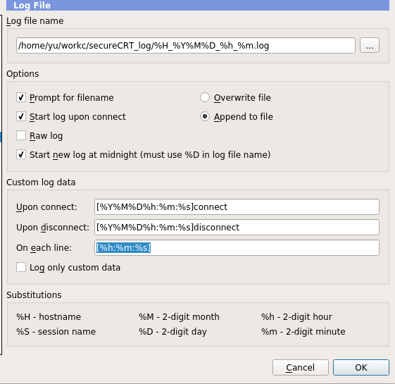

Monday ,Februnary 14 ,2022 时间驱动

# list：
1. Analyze the problem with matt.
2. linux kernel dirvers -timestamp.


# done
## secureCRT Log setting:
```
/home/yu/workc/secureCRT_log/%H_%Y%M%D_%h_%m.log
[%Y%M%D%h:%m:%s]connect
[%Y%M%D%h:%m:%s]disconnect
[%h:%m:%s]
```

  

record myself branch infomation：
1. develop_base_temp_fix_7211fw demokit板子，临时出货，验证屏幕闪烁问题。
2. develop_base_temp_fix_bug2280 亿镜项目usb2.0 witch 。junkev2
3. develop_base_temp_fix_bug2282 typc优化项目
4. develop_temp_fix_timestmp sync timestamp JunkeV2
5. 


# [git] your branch is ahead of ... 解决办法

出现该问题表示在次之前已经有X个commite了，执行命令
git reset --hard HEAD~X
解决其中X表示有多少次提交，此命令的意思是回退到x个commit之前。
git reset --hard HEAD~X
git pull --rebase


0glass B50 
- 仿真看下，log 查看Fisheye是否挂载上。由于自己不收


今日完成：
时间同步驱动测试。


02 bd df 


