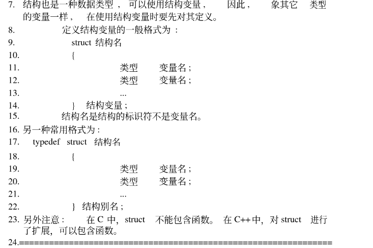

Tuesday ,Februnary 15 ,2022 时间驱动

# list：
1. reappear training failed，check HW signal with matt.
2. confirm information with zhanpeng.
3. Assit matt to repair and debug the software.
4. bringuo up framework .

# DONE:
1. bringuo up framework .
  

2. deal no dp signal question:
- detect HPD and  AUX  is normal
- need post devies to lontium.
- wait me detect window PC display 

3. times driver
- gpio disconnect , need check it . 
- 
