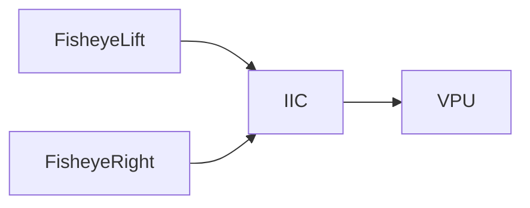

##include "Thursday ,Februnary 16 ,2022 maintenance"

# List：
- [x] timestamp driver
- [ ] samsun mobile phone open app error. -- zhanpeng
- [x] The board of 0glass disable open RGB camera. -- Tony
- [x] 0glasses download usb port when connect fisheye. -- zhaopeng
- [ ] Post devices to LONTIUM analysis DP aux signal. 

# Done：
4号板子：
- 无法打开RGB摄像头。
- init narmal Camera type : ov13850
- 刷屏 UsbPumUACAppI_StartWrite No free 1 UBUFQE
- fisheye无法打开。
- RGB 无法打开
- tof 无法打开
- imu无数据
- 芯片有发热

5号板子：
- 无法打开RGB摄像头。
- 无法打开fisheye
- tof无法打开
- imu无法打开
- 没有 init narmal Camera type : ov13850
- 芯片有发热
- log：build_num5.log
- 仿真运行glass软件，用guvcivew开fisheye可以，但是切换到rgb仿真运行就会出现崩溃。
- 仿真运行glass软件，用xslam就会报，MIPI DPHY ERROR CTRL 3,2 ,dphy_stat 0x0

6号板子：
- 无法打开RGB摄像头。
- init narmal Camera type : ov13850
- 刷屏 UsbPum：UACAppI_StartWrite No free 1 UBUFQE
- 使用VSC_COMMON_TEST，开启RGB，Jtag报异常崩溃。
- 崩溃地址：uacapp_outcall.c 554,usb_audio_handler.c 

## fisheye 不通：1~3 号板子。
description ： two fisheye used common iic bus， they's common address . we ignore iic ack warning in source code.
function: cam_handles.c 
driver: framepumpov7750.c

