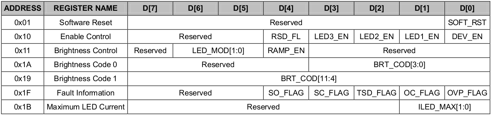

##include "Tuesday , Februnary 22 ,2022 framewrok"

# List：
- [x] DP_EVT_4cam_DVT Backlight
- [ ] DP_EVT_4cam_DVT RGB
- [x] DP_EVT_4cam_DVT Display Votage


# Done:
1. LED backlight 
- SGM37603AYG/TR
- setting Maximum 40mA 
- support adjust interface 
- two ic contral
- led1 and led2 enable
- BLKT_EN = 1 enable ic 
- iic control Maximum Current.
- pwm adjust light.（Duty ratio）. MIPI output.
- IIC address 0x36
-   

```C
reset = 0
enable control = 0001 0111
brightness control = 0011 1000
brightness code REG[0] = 0000 0111
brightness code REG[1] = 1111 1111
Information = read only
Maximum Current = 0x00 ~ 0x03

```
  
2. Display power 
- RT4801HWSC 
- DISP_VSP_EN(GPIO28)=1;
- DISP_VSN_EN(GPIO29)=1;
```
iic_start();
IIC_SLAVE_ADDRESS();
IIC_READ/WRITES();
iic_stop();

VOP 00h 11h
VON 01h 11h
DISP 03h 43h
DISN 03h 43h
APPS 03h 43h
```


