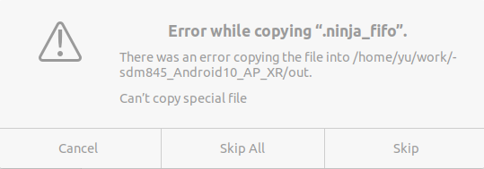

Friday ,January 26,2022

# List:
1. Glass  plug the samung's mobile phones ,occasionally fails to open.
2. linux kernel driver development.
3. work report for leader.

4.跟田总沟通三个缺陷。
(1)type-c优化问题。最好还剩余６％，抓取日志后给龙迅。
(2)usb2.0切换，保存flash参数。分支不合并，和matt商定后再做解决定。
(3)三星手机，usb连接失败，在固件中，把音频占用的usb2.0释放掉。


# Done:
1. [question]:  [E34R][EVT] [手机兼容性] E34R 连接三星S21 手机即使有外部供电也无法打开viewer （10/10）
- information:
  - Samsung phone ip:192.168.22.139:5555 
  - 1plus+ phone ip:192.168.22.66:5555 
  - Glass  plug the samung's mobile phones ,occasionally fails to open.
  - adb -s 192.168.22.139:5555 logcat | tee $(date "+%Y%m%d%H%M%S")samsungandroid.txt
－tee $(date "+%Y%m%d%H%M%S").txt

  - 手机系统运行的日志。
  - 眼镜的日志。
- casue:
- plan:
  - collect glass logs.Normal and failes log.

# 日志
## 手机怎么获取系统日志,
  - adb logcat
  - adb logcat | tee ~/work/workspace/samsung.log
  - adb connect 192.168.22.139:5555 （wifi）
  - scrcpy -s 192.168.22.66:5555
1. samsung phone：
- android :01-28 11:44:43.187 28777 31504 E std     :
```
   Read HID failed: 
01-28 11:58:15.402 31902   603 I Unity   : Failed to get fd 
01-28 11:58:15.402 31902   603 I Unity   : (Filename: ./Runtime/Export/Debug/Debug.bindings.h Line: 35)
```
- xvGlassControlTool_V0.2:收集上来，但是看不出来什么。
1. １plus手机：
- 可以正常收集
  

cougar_lite 没同步

 - 怎么获取眼镜日志。
1. [development]: linux kernel driver development.


2. [development] dabeng_EVT:audio debug,

# 问题
１. [question]error: more than one device/emulator
- [slove]解决方法是为ADB命令指定设备的序列号了。adb help会提示“-s SERIAL  use device with given serial (overrides $ANDROID_SERIAL)”，比如adb -s 序列号 logcat 或者adb -s 序列号 shell 
2. [question]ａｎｄｒｏｉｄ手机使用ａｄｂｉｎｓｔａｌｌａｐｋ文档。

# 问题
１. [question]error: more than one device/emulator
- [slove]解决方法是为ADB命令指定设备的序列号了。adb help会提示“-s SERIAL  use device with given serial (overrides $ANDROID_SERIAL)”，比如adb -s 序列号 logcat 或者adb -s 序列号 shell 
2. [question]ａｎｄｒｏｉｄ手机使用ａｄｂｉｎｓｔａｌｌａｐｋ文档。


## android linux kernel driver 
１. 学习安卓系统驱动开发。
２.　驱动在driver/yundriver/xvdg/xvtest.c


## 编译大鹏板子
make -j4 debug BOARD=Dapeng_EVT #


## usb2.0问题。
把在xvGlassControlTool_V0.2测试ｆｌａｓｈ命令。


源码编译：
Ubuntu20.04 编译Android 10源码 并烧录源码到hikey960中的避坑指南
https://blog.csdn.net/weixin_38355732/article/details/113055681
  


编译报错：android10  ninja failed with: exit status 137
https://blog.csdn.net/u011426115/article/details/116279143

export LC_ALL=C
