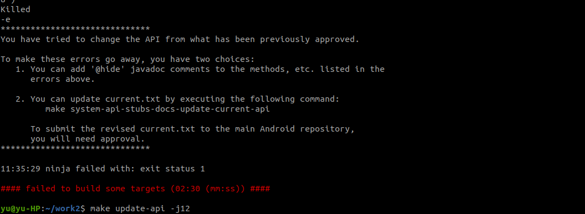
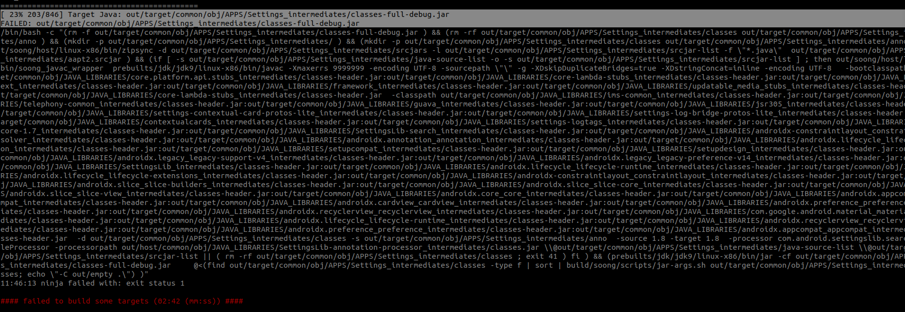

Sunday ,January ,2022

# List:
1. android code and complie

# Done:
1. 参考博客
- Ubuntu18.04 编译 Android10.0 系统源代码
https://cczheng.blog.csdn.net/article/details/104144461?spm=1001.2101.3001.6650.1&utm_medium=distribute.pc_relevant.none-task-blog-2%7Edefault%7ECTRLIST%7ERate-1.pc_relevant_aa&depth_1-utm_source=distribute.pc_relevant.none-task-blog-2%7Edefault%7ECTRLIST%7ERate-1.pc_relevant_aa&utm_relevant_index=2

- Ubuntu20.04 编译Android 10源码 并烧录源码到hikey960中的避坑指南
https://blog.csdn.net/weixin_38355732/article/details/113055681
编译安卓系统：

  

  

# resourse:
- naoopc-t4:

  - cat /proc/version                            
Linux version 4.4.167 (root@jensen) (gcc version 6.3.1 20170404 (Linaro GCC 6.3-2017.05) ) #1 SMP PREEMPT Wed Jun 17 17:07:27 CST 2020

  - adb shell getprop ro.build.version.release
Android：8.1.0

- junke-亿镜

Linux version 4.4.63-perf (czw@EmdoorVR) (gcc version 4.9 20150123 (prerelease) (GCC) ) #3 SMP PREEMPT Wed Jan 5 16:07:39 CST 2022

##  OpenJDK8

- 写给Android开发者的Kotlin入门
https://www.cnblogs.com/it-tsz/p/10751332.html

- Linux系统NVME盘分区和挂载
https://www.jianshu.com/p/04327f1b97cb

Android mmm单独编译模块 错误提示 APPS/Settings_intermediates/classes-full-debug.jar] Error 41

https://blog.csdn.net/penglijiang/article/details/68945735?fps=1&locationNum=11