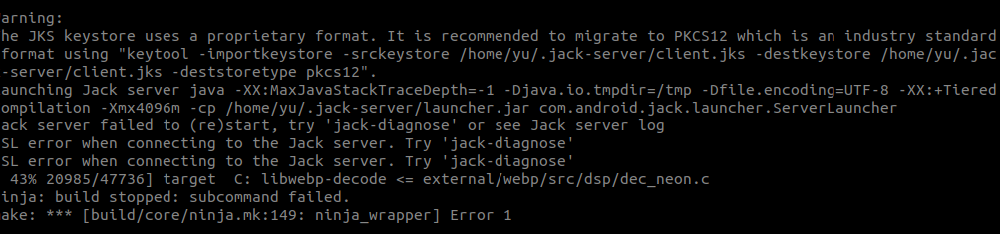

Sunday ,January ,2022

ubuntu20.04安装SecureCRT8.3

https://blog.csdn.net/guguda1111/article/details/121243807?spm=1001.2101.3001.6650.2&utm_medium=distribute.pc_relevant.none-task-blog-2%7Edefault%7ECTRLIST%7ERate-2.pc_relevant_aa&depth_1-utm_source=distribute.pc_relevant.none-task-blog-2%7Edefault%7ECTRLIST%7ERate-2.pc_relevant_aa&utm_relevant_index=5

  

  

ubuntu新增加固态硬盘，格式化并挂载到根目录下 
https://www.cnblogs.com/bpdhpm/p/11384473.html

ubuntu16.04 编译Android AOSP源码 android10
https://blog.csdn.net/mingmigndfds/article/details/113884464

export LC_ALL=C

Android：JACK编译错误汇总及解决
https://www.cnblogs.com/blogs-of-lxl/p/11589521.html

Android7.0 配置JACK支持多用户同时编译
https://www.cnblogs.com/schips/p/android_n_config_for_mutil-user_build.html