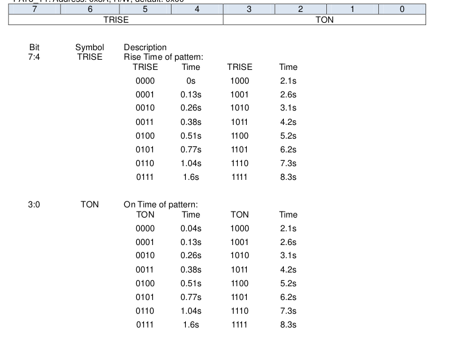
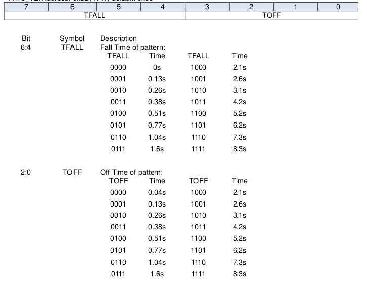

##include "Tuesday , March 1 ,2022"

# 关于RGB灯接口
0X02 0xBE 0X9A 0X01 0x01 待机
0X02 0xBE 0X9A 0X02 0x01 [1~6] 正常工作单色呼吸灯循环1~6 为配置索引（默认 Trise  = 1s,Ton=0.004s,Tfall = 1s,Toff=0000s）
0X02 0xBE 0X9A 0X02 0x02 0x04  正常工作4色呼吸灯循环（默认 Trise  = 1s,Ton=0.004s,Tfall = 1s,Toff=0000s）
0X02 0xBE 0X9A 0X02 0x03 0x08  正常工作8色灯常亮循环切换 （默认切换时间Tswitch=0.04s）
0X02 0xBE 0X9A 0X02 0x03 0x14  正常工作20色灯常亮循环切换 （默认切换时间Tswitch=0.04s）
0X02 0xBE 0X9A 0X02 0x03 0x60  正常工作96色灯常亮循环切换 （默认切换时间Tswitch=0.04s）
0X02 0xBE 0X9A 0X02 0x04       正常工作单色灯真彩循环切换。默认RGB=FFFFFF
0X02 0xBE 0X9A 0X02 0x04 [1~6] 正常工作单色灯真彩循环切换，从6个颜色中选择
0X02 0xBE 0X9A 0X02 0x04 [1~6] 正常工作单色灯真彩循环切换，从6个颜色中选择
0X02 0xBE 0X9A 0X03 0x01 配置状态绿灯常亮
0X02 0xBE 0X9A 0X04 0x01 异常状态红灯常亮

寄存器透传接口（可以直接修改寄存器）：
0X02 0xBE 0X9A 0X05 [地址][值] 寄存器透传设置
0X02 0xBE 0X9A 0X06 [地址]     寄存器透传获取

0X02 0xBE 0X9A 0X07 0x01 [Trise+Ton] 设置上升时间，长亮时间，下降时间，关闭时间。只是这设置pattern1
0X02 0xBE 0X9A 0X07 0x02 [Tfall+Toff]设置上升时间，长亮时间，下降时间，关闭时间。只是这设置pattern1
0X02 0xBE 0X9A 0X07 0x03 [Tswitch] 设置常亮的切换时间。(0~255)*100ms，只是在常亮切换时有效

  
  

example：
1. 设置呼吸效果：0X02 0xBE 0X9A 0X07 0x01 0x60,0x60,Trise = 1.04s,Ton = 0.04s Tfail=1.04s Toff = 0.04s

2. 设置常亮切换：0X02 0xBE 0X9A 0X07 0x01 ，0x01 Twitch = 1*100ms

