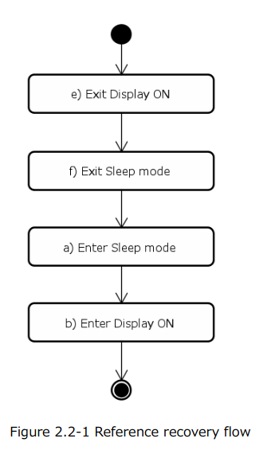

# List：
- [ ] vsync time driver codev merg
- 代码完成，提交分支，等待碧玉集成后验证。
- [ ] esd surpport 

 
# Done:
1. esd surpport
- plan: 
    - framework analysis :only replace panel esd check
    - code debug  
- phony code :
  

# done
1.中午是OK的。
保证除了BOX,其他都一样。
Linux version 4.4.63-perf (czw@EmdoorVR) (gcc version 4.9 20150123 (prerelease) (GCC) ) #1 SMP PREEMPT Thu Mar 10 21:55:31 CST 2022

Linux version 4.4.63-perf (czw@EmdoorVR) (gcc version 4.9 20150123 (prerelease) (GCC) ) #1 SMP PREEMPT Fri Mar 11 16:55:38 CST 2022

echo 4 > dev/MicroUsb_dev

休眠：
echo 5 > dev/MicroUsb_dev 
系统处于非休眠状态下，输指令测试

adb reboot edl
