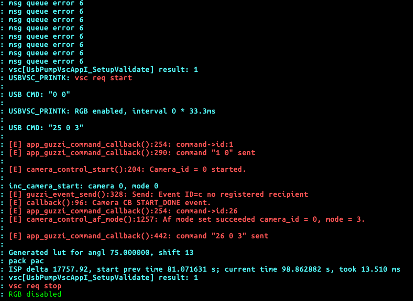

# List：
- solve RGB bug
- 验证fisheye问题。

1.  Plgispproc.cpp threadFunc 这个是RGB图像处理线程，在err处理线程中加打印。
2.  Usb_vsc_app.c  2413 write这RGB线程写入函数，写到RGB模块中。

# List

cam_handler.c ==> framepump_thread() 
usb_vsc_app.c ==> write ==> USB 
Plgispproc.cpp 

0x02 0xfd 0x66 0x00 0x02  获取flash参数。

reciveRgbFrame(usbFrame * frame)
enable: RGB==>disable RGB

