# POINT:
Type-C 扩展器 方案指南（DP Alternative Mode 篇）
雷电接口与TYPE-C接口关系问题，雷电就是充电功能。
Type-C 的DP Alt Mode 模式被激活后可以维持三大功能同时正常运作，分别是供电、DP传输以及USB 传输

DP Alt mode 主机口构成

多功能Type-C 主机接口本质上只要把USB和DP的线路塞在一个Type-C插头里就可以。但是为了灵活调用和防止Type-C正反插酿成悲剧，在接口屁股上又加了multiplexer（多路复用器，以下简称MUX）[8]将USB和DP信号的物理线路随心所欲地排布在Type-C接口中，另外也增加了PD控制器用来控制MUX；同时这个控制器可以跟下游的PD控制器沟通，一旦对上暗号，那么两端就可以按照商量好的 DP Alt Mode 来控制 MUX 排好输出线路的顺序，这样就可以USB 归USB，DP归DP了。
可以从下图的功能框图看到，MUX和PD控制器的上游，则是主机的USB Host（USB主控）以及 DP Source（DP信号源）， Type-C的性能三维就是由这些上游的应用以及MUX本身的性能所决定的了（MUX走USB和DP信号，会影响这二维的性能）
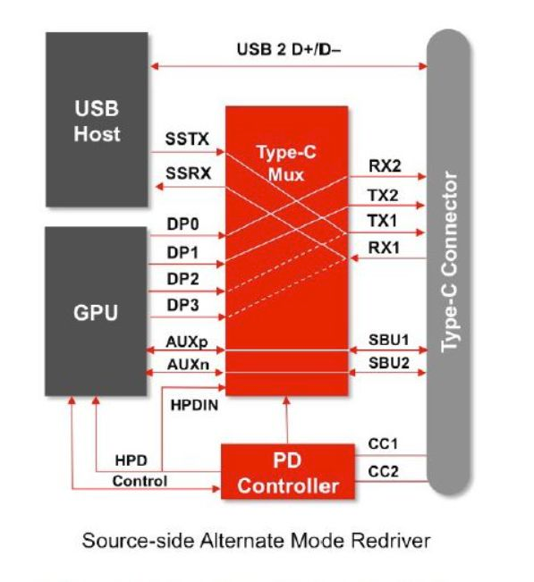  

DP Alt mode 设备口构成

如下图所示[8]总体来说跟主机口没什么区别，也还是 PD 控制器加上 MUX的形式，区别只在于这里的MUX是解复用功能

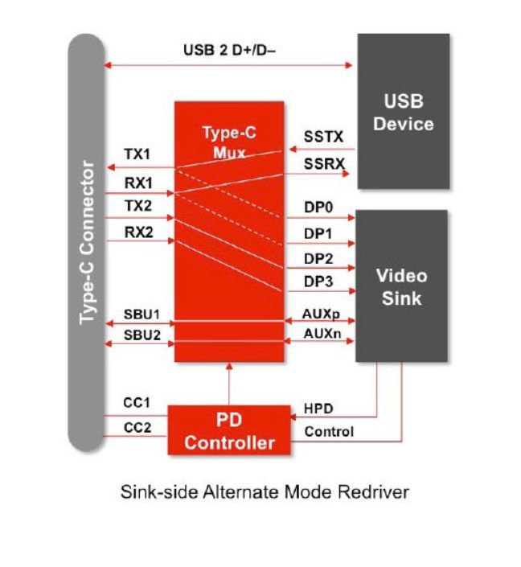  

但是，但是啊，我们已经拆过不少 Type-C转接器了，为什么不少大厂转接器包括 DA310以及 微软的 USB-C Travel Hub[10] 等等，只有PD控制器而没有MUX？！这不是跟指导文档背道而驰吗
先进型 Type-C 扩展设备拆解存档​
www.zhihu.com/column/c_1326635507015319552

但其实文档介绍的是基于完整的 Type-C 接口所设计的结构，即设备端是具有完整的Type-C母口，需要独立的线缆进行连接的情况；Type-C 接口文档虽然没有明确指示，但是 对于独立的USB-C 线缆，也是有正反的属性的
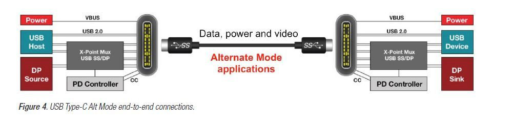  

但其实文档介绍的是基于完整的 Type-C 接口所设计的结构，即设备端是具有完整的Type-C母口，需要独立的线缆进行连接的情况；Type-C 接口文档虽然没有明确指示，但是 对于独立的USB-C 线缆，也是有正反的属性的
经过了设备端的解复用之后，留给下游的又是简单纯粹的 USB 协议口和 DP 协议口（USB2.0 和 DP的 Configuration 通道仍需要 PD控制器转发来保证正常功能），在原先开发的各种USB 玩法 以及 DP玩法 可以直接捡起来套上去，不得不说这样的Type-C 开发出来对原先的硬件环境十分友好，和先前仅有的区别是，原本井水不犯河水的 USB 和DP 配件，如今由于 DP Alt Mode的存在被整合到一块电路板上（就像早期 HP Dell以及联想等厂商开发的 那种巨硕的底座式笔记本坞站）。

USB与DP 进阶硬件认识

在硬件上将 PD 控制器和 MUX 融入 Type-C以后，事实上 Type-C就可以被凹成各种形状了，但主流 的模式其实就两种（按性能分为两种，实际VESA对应定义了6种[4]）

首先我们需要对 USB 和 DP 有 基本的硬件认知

目前的信号传输依然主要依靠铜线缆，差分对则是经典的用于铜缆系统的抗干扰硬件设计[12]

简单的来说，我们使用两根线来传输一个信号，即一个差分对一个传输通道

在USB3.2 Gen1和Gen2 中，他们使用一组两个差分对四根线分别实现 5Gbps 和 10Gbps 的收发活动即SSTX 差分对和SSRX 差分对

R→Receive 收

T→Transmit 发

因此在USB中 一组收发 可以实现 10Gbps的 双向传输，USB3.2 Gen2x2可以启用两组共四对信号，因此可以实现 20Gbps 双向传输（是的，Gen2不需要D+D-来传输，Gen2 跟 Gen2x2 只是量变，Gen1 到 Gen2 才是质变，而只使用D+D- 的USB2.0则跟USB3.0可以算是两个物种了）
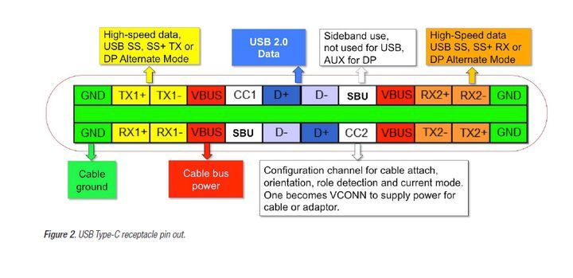  

一个完整的DP接口同样含有4对主要连接差分对，Mian Link Lane 0~3 (以下简称ML）

在HBR2下可以完成 每Lane 5.4Gbps的单向传输，HBR3下则是8.1Gbps

除此之外，DP接口还内置了Configuration 1&2 用于协议配置，Auxiliary Channel +&- （以下简称Aux对）用于音频传输，有趣的是，DP同样可以在仅 ML0，ML1 两条Lane的模式下工作

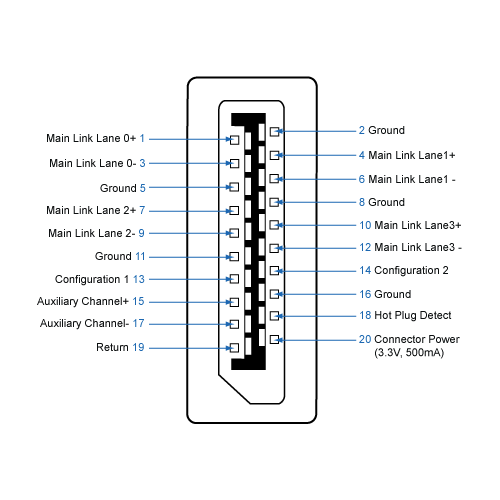  

那么，把USB 限制在 2对差分模式，DP也限制在2对差分模式，可以拼在一起吗？

DP Alt Mode 主要模式

答案是肯定的

用于通讯握手的PD协议必须占用一条 Configuration Channel（以下简称CC），电源线和接地定义也不能动，不过剩下的也足够其他协议分的了

常规情况 USB 模式时 Type-C 的针脚分布如下

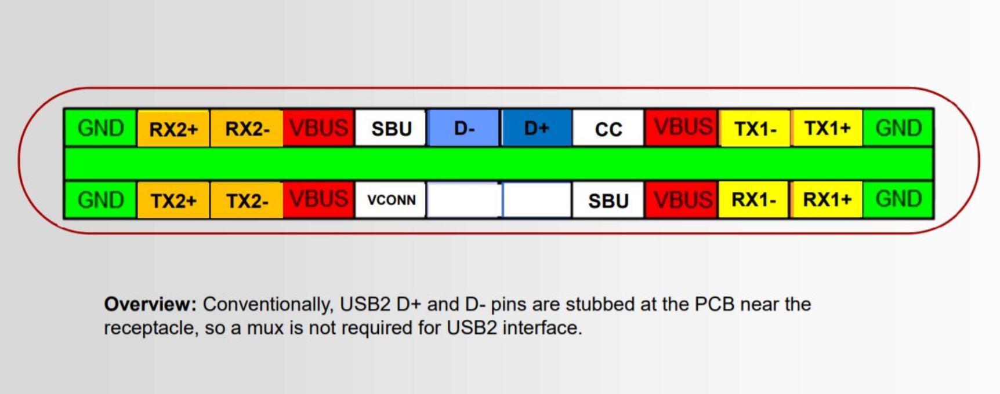  

当激活 DP Alt Mode 2Lane （Multi-Function DisplayPort,MFDP) 时，针脚功能如下

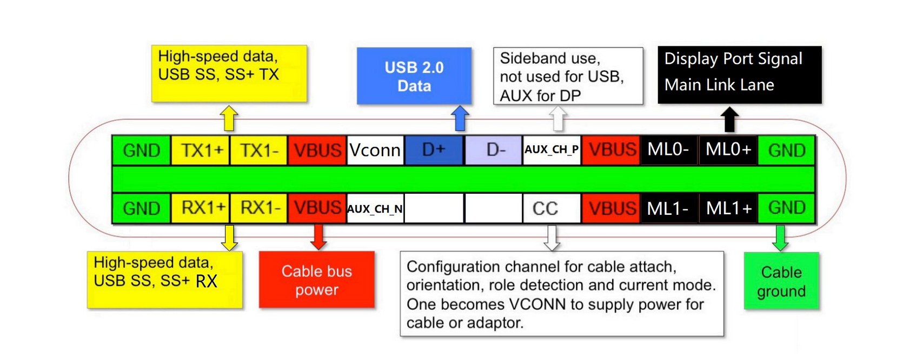  

当激活成 DP Alt Mode 4Lane 时：
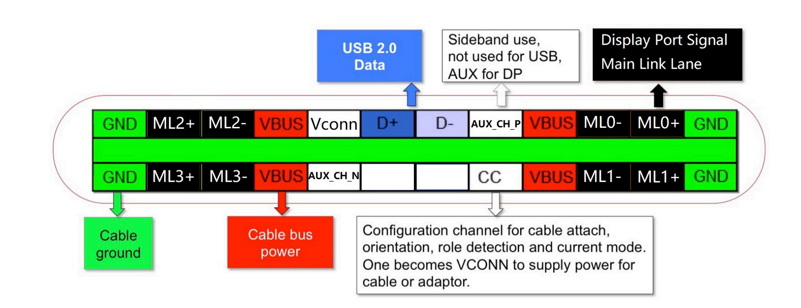  

有没有觉得USB2.0 由于正反插支持占用了4个针脚，只有两个有效，而且480Mbps这么孱弱的速度塞进Type-C实在是丢人？

如果把USB2.0的针脚设定为USB3.2 Gen1或者Gen2 就好了，这样的模式也是有的，被称为Virtual Link，是为VR应用所开发的，Nvidia 的2000系 和AMD 的6000系显卡所搭载的Type-C 就支持该模式[13]
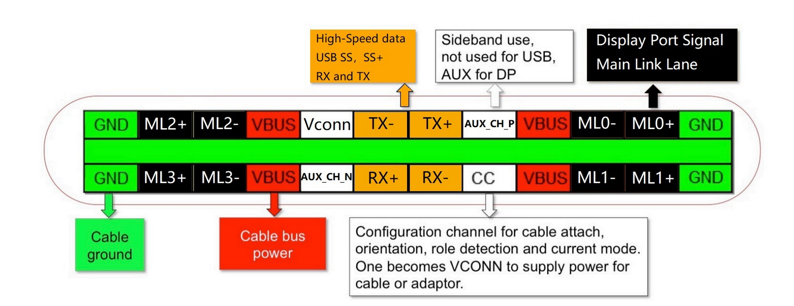  

注意了，此模式不在 DP Alt Mode的范畴，常规设备是不支持也触发不了这个模式的。

在Virtual Link 模式下，Type-C和常规 Type-C线缆可以达到非雷电模式下的最高速度，高达4*8.1+10=42.4Gbps的输出带宽外加10Gbps的数据接收带宽

尽管常规的 DP Alt Mode 会在纸面数据上比 Virtual Link 模式稍逊色一些，但是 满足绝大部分的应用场景也已经不成问题了

## 如何触发 DP Alt Mode

如上文提到的， 不管是DP Alt Mode 还是上面提到的 Virtual Link，抑或是雷电，都是作为Alt Mode 触发的，而触发方式，都是通过Power Delivery 的通信功能
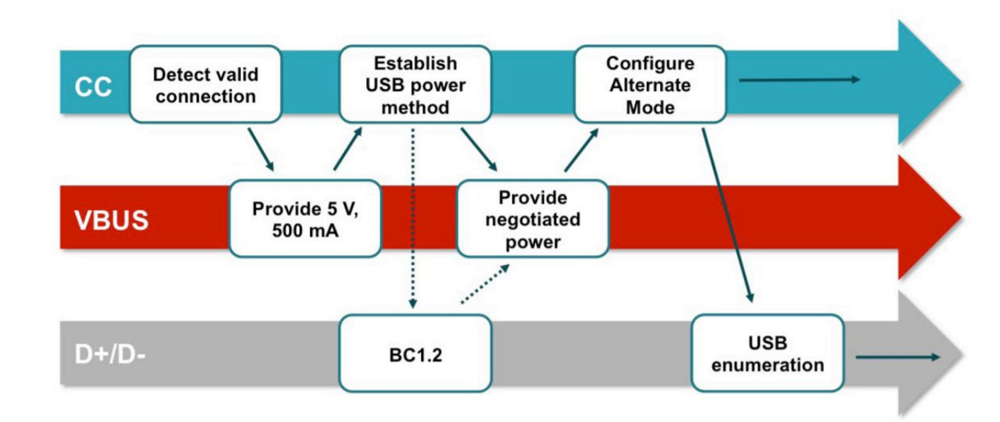  
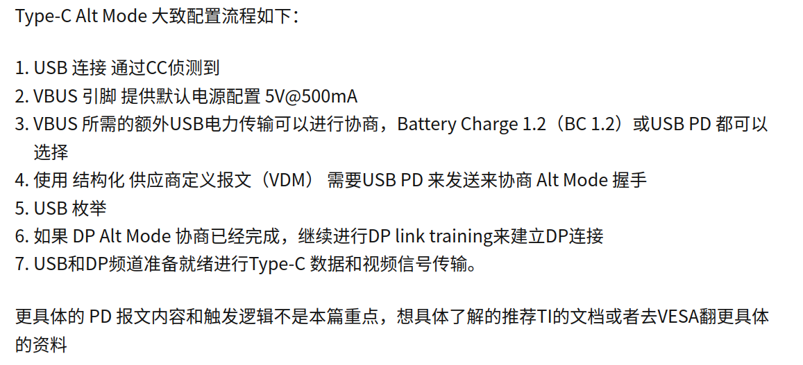  
https://link.zhihu.com/?target=https%3A//www.ti.com/lit/an/slva844b/slva844b.pdf%3Fts%3D1614791986776%26ref_url%3Dhttps%25253A%25252F%25252Fwww.ti.com%25252Fsitesearch%25252Fdocs%25252Funiversalsearch.tsp%25253FsearchTerm%25253DAlternate%252BMode%252BSupport

TYPE-C
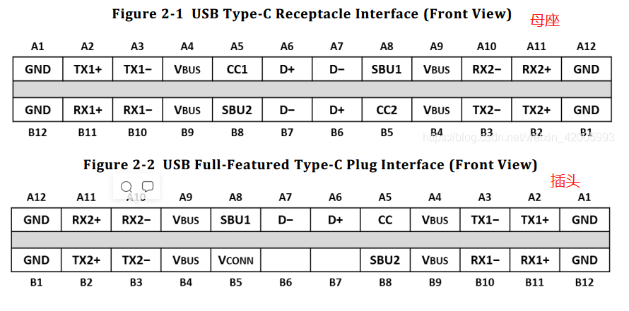  
