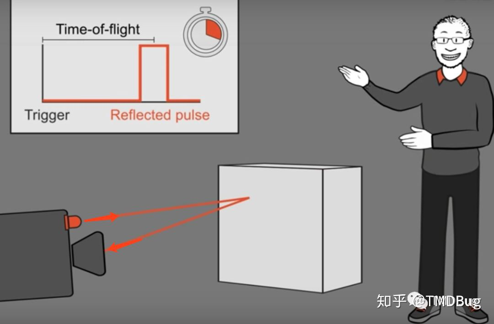
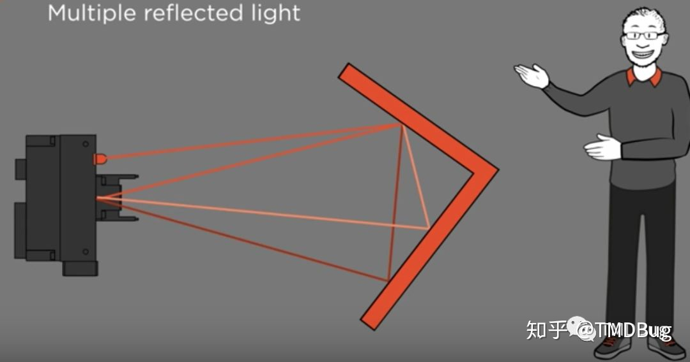

# ToF摄像头？

&emsp;  广角镜头，长焦镜头，潜望式长焦镜头，3D镜头，人像镜头、打孔镜头等等，当然还有个新名词ToF镜头.
ToF是Time-of-Flight的缩写，直译就是"飞行的时间"

&emsp;  其实ToF只是一种技术的缩写，由一组人眼看不到的红外光（激光脉冲）向外发射，遇到物体后反射，反射到摄像头结束，计算从发射到反射回摄像头的时间差或相位差，并将数据收集起来，形成一组距离深度数据，从而得到一个立体的3D模型的成像技术。

  
根据光的飞行时间，计算出一组有深度的数据，估计它的命名由此而来吧。据说这是最快捕获3D信息的方法了。相比于结构光方案，TOF的有效深度信息点达到了30万个，为结构光方案的10倍数。这样一来，就可以通过3D模型做各种应用。

1. 首先是基础拍照。可以在拍摄照片时，将景深拍的更真实，不再依赖算法虚化背景。
2. 在物体识别方面也更精准。可以扫描镜头前面的物体，识别手势，室内导航等，增强手机的感知能力。
3. 在AR体验上肯定会有所改善，有一些具有AR的游戏中，对人体姿势及手势的识别也更为精准。
4. 在具有一些需要深度扫描的应用中，也能更突出细节。

其实ToF技术已经在各个领域中应用了，比如无人机避障，无人驾驶汽车或机器人的避障，机械臂自动搬运，医疗监护等等。

但是ToF技术也是有一些局限性

1. 当拍摄物体具有多个棱角时，会造成光线折射返回到摄像头，导致测量结果失真。

  

2. 强烈的阳光也会导致镜头芯片快速饱和无法检测红外的真实性，导致失真。
3. 如果有多台ToF设备在进行工作时，会导致红外传入其他镜头中，形成互相干扰，导致失真。
4. 它的最小距离也得是1cm, 低于1cm将无法使用

不过，整体来说，ToF还是给机械视觉带来了革命性的变化，广泛的应用于各种场景和领域。

# Tof 摄像头
摄像头标定是干啥？

